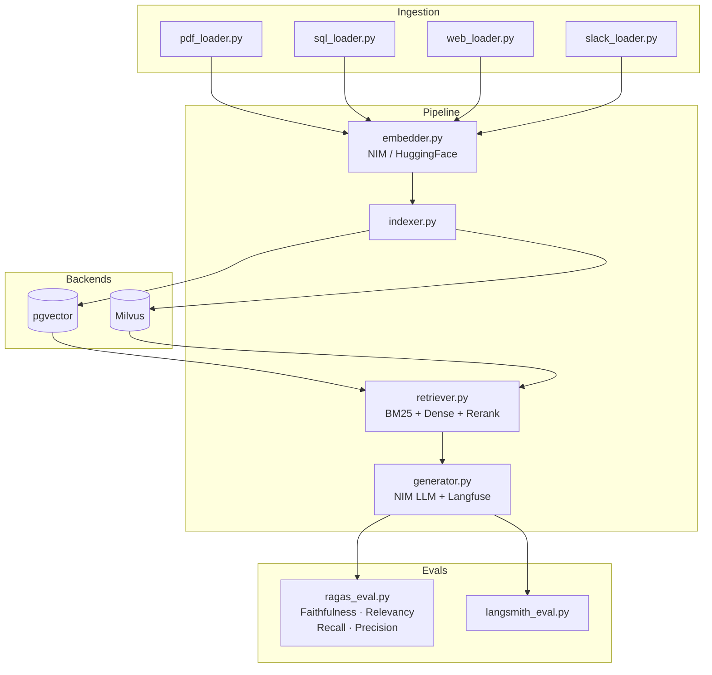

# enterprise-rag-pipeline — Architecture

## System Diagram

## Key Design Decisions

- **Swappable backends:** `backends.yaml` controls pgvector vs Milvus — no code changes needed
- **Hybrid retrieval:** BM25 (40%) + dense (60%) ensemble, reranked by cross-encoder
- **NIM embedding:** `nvidia/nv-embedqa-e5-v5` via OpenAI-compatible API
- **RAGAS eval:** 4 core metrics tracked per pipeline config change — `faithfulness`, `answer_relevancy`, `context_recall`, `context_precision`
- **Langfuse tracing:** Every LLM call is traced for latency and token cost
- **NeMo Retriever:** Drop-in replacement for `retriever.py` layer when scaling to enterprise

## Component Map

| Layer | File | Responsibility |
|---|---|---|
| Ingestion | `ingestion/pdf_loader.py` | PyMuPDF → chunked Documents |
| Ingestion | `ingestion/sql_loader.py` | Schema-aware table → Documents |
| Ingestion | `ingestion/web_loader.py` | Playwright scraper → Documents |
| Ingestion | `ingestion/slack_loader.py` | Slack export JSON → Documents |
| Pipeline | `pipeline/embedder.py` | NIM or HuggingFace embeddings |
| Pipeline | `pipeline/indexer.py` | Upsert to vector backend |
| Pipeline | `pipeline/retriever.py` | BM25 + dense hybrid + rerank |
| Pipeline | `pipeline/generator.py` | NIM LLM + Langfuse tracing |
| Backends | `backends/pgvector_backend.py` | pgvector CRUD |
| Backends | `backends/milvus_backend.py` | Milvus CRUD |
| Evals | `evals/ragas_eval.py` | RAGAS 4-metric eval + JSON report |
| Evals | `evals/langsmith_eval.py` | LangSmith dataset + evaluator |
