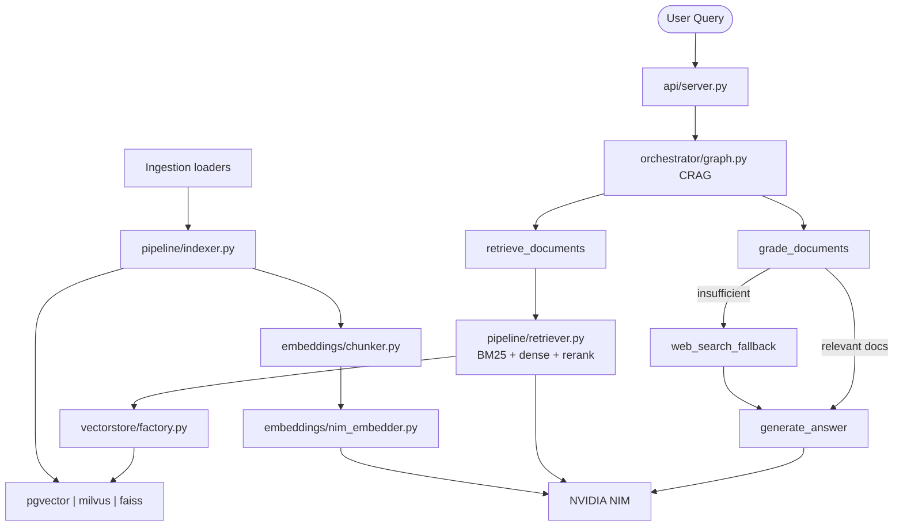

# Enterprise RAG Pipeline — Architecture

## System Overview

Production-grade multi-source RAG pipeline with pluggable vector backends, hybrid BM25 + dense retrieval, optional reranking, Corrective RAG (CRAG) orchestration, and RAGAS-driven evaluation. All LLM calls are traced through Langfuse when credentials are configured.

## High-Level Data Flow



## Directory Structure

| Directory | Purpose |
|---|---|
| `ingestion/` | PDF, SQL, web, and Slack document loaders |
| `pipeline/` | Embedder, indexer, hybrid retriever, generator (Langfuse-traced) |
| `backends/` | `PgVectorBackend`, `MilvusBackend` implementing `VectorStoreBase` |
| `embeddings/` | NIM embedder and text chunker |
| `vectorstore/` | `VectorStoreBase` ABC, factory, FAISS dev store |
| `retriever/` | Re-export of canonical `pipeline.retriever.HybridRetriever` |
| `orchestrator/` | CRAG LangGraph graph, state, and nodes |
| `core/` | Shared observability and exception types |
| `evals/` | RAGAS and LangSmith offline evaluation harnesses |
| `api/` | FastAPI gateway (`api/server.py`) |
| `deploy/` | Dockerfile, compose, k8s, Helm |
| `tests/` | pytest suite mirroring source layout |

## orchestrator/ — Corrective RAG (CRAG)

The CRAG graph in `orchestrator/graph.py` implements the canonical flow:

```
retrieve_documents → grade_documents → route_generation
  ├─ relevant docs → generate_answer → END
  └─ insufficient  → web_search_fallback → generate_answer → END
```

- **State** (`orchestrator/state.py`): `RAGState` TypedDict with append-only `documents` and `grade_scores`.
- **Iteration cap**: `MAX_ITERATIONS = 3`; when grading finds no relevant docs and the cap is reached, generation proceeds with empty context.
- **Web fallback** (`orchestrator/nodes/web_search.py`): Tavily when `TAVILY_API_KEY` is set; DuckDuckGo otherwise.
- **Observability**: All LLM nodes build models via `orchestrator/nodes/_llm.py`, attaching Langfuse callbacks from `core/observability.py`.

## embeddings/

- **`nim_embedder.py`**: Wraps NIM OpenAI-compatible embeddings (`NIM_EMBEDDING_MODEL`).
- **`chunker.py`**: `RecursiveCharacterTextSplitter` with `CHUNK_SIZE` and `CHUNK_OVERLAP` from the environment (defaults 512 / 64).

## vectorstore/

- **`base.py`**: `VectorStoreBase` ABC — `upsert_documents`, `similarity_search`, `delete`, `as_retriever`, `health_check`.
- **`factory.py`**: Reads `VECTORSTORE_BACKEND` (`pgvector` | `milvus` | `faiss`); accepts legacy `VECTOR_BACKEND` alias.
- **`faiss_store.py`**: In-memory FAISS for local dev; logs a production warning on init.

## retriever/

The canonical hybrid retriever lives in `pipeline/retriever.py`:

1. **BM25** sparse retrieval over an in-memory corpus.
2. **Dense** retrieval via the active vector backend.
3. **Fusion** with `EnsembleRetriever` (weights from `BM25_WEIGHT` / `DENSE_WEIGHT`).
4. **Reranking** when `USE_RERANKER=true`:
   - `RERANK_BACKEND=cross-encoder` (default): HuggingFace cross-encoder.
   - `RERANK_BACKEND=nim`: NIM reranker API (`NIM_RERANK_MODEL`).

`retriever/hybrid_retriever.py` re-exports `HybridRetriever` for backward-compatible imports.

## api/

- **`server.py`**: Single production entry point. Lifespan initializes embedder, vector store, indexer, hybrid retriever, and compiled CRAG graph.
- **Routes**: `GET /health`, `POST /ingest`, `POST /ingest/pdf`, `POST /ingest/url`, `POST /query`, `GET /query/stream`.
- **`main.py`**: Deprecated re-export of `server.app`.

## Environment Variables

| Variable | Description |
|---|---|
| `NVIDIA_API_KEY` | NIM API key (canonical) |
| `NIM_API_KEY` | Fallback alias for cross-repo consistency |
| `NIM_BASE_URL` | NIM OpenAI-compatible endpoint |
| `CHAT_MODEL` | Generation model name |
| `NIM_EMBEDDING_MODEL` | Embedding model name |
| `VECTORSTORE_BACKEND` | `pgvector`, `milvus`, or `faiss` |
| `VECTOR_BACKEND` | Legacy alias for `VECTORSTORE_BACKEND` |
| `PGVECTOR_URL` | Postgres connection string |
| `PGVECTOR_COLLECTION` | pgvector collection name |
| `MILVUS_URI` | Milvus server URI |
| `MILVUS_COLLECTION` | Milvus collection name |
| `CHUNK_SIZE` | Text splitter chunk size (tokens) |
| `CHUNK_OVERLAP` | Text splitter overlap (tokens) |
| `RETRIEVER_TOP_K` | Documents returned per query |
| `BM25_WEIGHT` | Sparse weight in hybrid fusion |
| `DENSE_WEIGHT` | Dense weight in hybrid fusion |
| `USE_RERANKER` | Enable post-fusion reranking |
| `RERANK_BACKEND` | `cross-encoder` or `nim` |
| `RERANK_MODEL` | Cross-encoder model name |
| `NIM_RERANK_MODEL` | NIM reranker model name |
| `TAVILY_API_KEY` | Optional Tavily web search key |
| `LANGFUSE_PUBLIC_KEY` | Langfuse public key |
| `LANGFUSE_SECRET_KEY` | Langfuse secret key |
| `LANGFUSE_HOST` | Langfuse host URL |
| `LANGFUSE_NEXTAUTH_SECRET` | Self-hosted Langfuse auth secret |
| `LANGFUSE_SALT` | Self-hosted Langfuse salt |
| `LANGSMITH_API_KEY` | LangSmith tracing and evals |
| `LANGSMITH_DATASET` | LangSmith eval dataset name |

## Key Design Decisions

- **Backend swappability**: Switch vector stores via `VECTORSTORE_BACKEND` — no code changes.
- **Hybrid retrieval**: BM25 + dense ensemble with optional cross-encoder or NIM reranking.
- **CRAG pattern**: Document grading routes to web search when retrieval is insufficient.
- **Langfuse tracing**: Optional and graceful — empty callbacks when credentials are absent.
- **Eval isolation**: RAGAS and LangSmith modules are offline-only; never imported on the hot path.

## Integration with nvidia-nim-agent-toolkit

The DocAgent in `nvidia-nim-agent-toolkit` can delegate retrieval to this pipeline's `/query` endpoint, making this repo the RAG backend for the full agent system.
