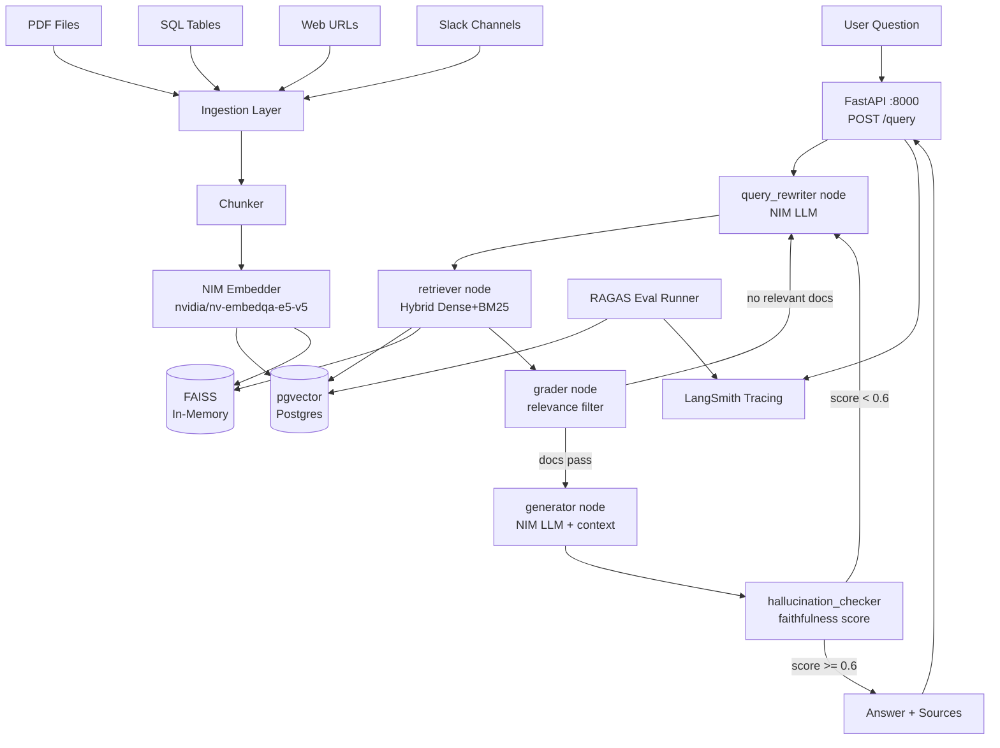

# Architecture — enterprise-rag-pipeline

## System Overview
Multi-source RAG pipeline with corrective retrieval loop, hallucination grounding, and RAGAS evaluation.

## Corrective RAG Loop
| Condition | Action |
|---|---|
| No relevant docs after grading | Rewrite query → re-retrieve |
| Hallucination score < 0.6 | Rewrite query → re-retrieve |
| retry_count >= 2 | Force generate with best available |

## Ingestion Sources
| Source | Loader | Chunking |
|---|---|---|
| PDF | pdfplumber / unstructured | recursive 512/64 |
| SQL | SQLAlchemy row→doc | none (row = chunk) |
| Web | httpx + BeautifulSoup | recursive 512/64 |
| Slack | slack-sdk messages | recursive 512/64 |

## Eval Stack
- **RAGAS** — faithfulness, answer relevancy, context precision, context recall
- **LangSmith** — experiment tracking, dataset versioning, regression CI
