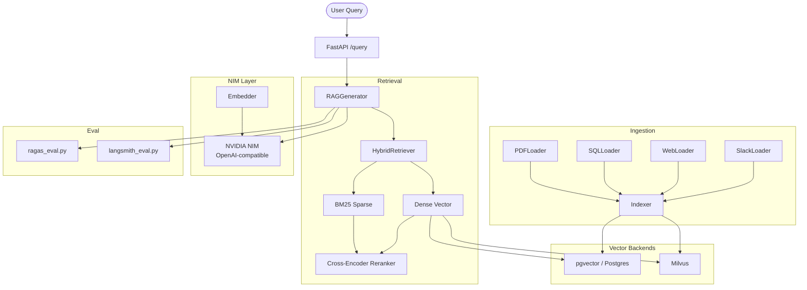

# Enterprise RAG Pipeline — Architecture

## System Overview

Production-grade multi-source RAG pipeline with pluggable vector backends, hybrid retrieval, and RAGAS-driven evaluation.

## Component Diagram

## Key Design Decisions

- **Backend swappability:** `VECTOR_BACKEND=pgvector|milvus` env var controls which store is used — no code changes
- **Hybrid retrieval:** BM25 (40%) + dense (60%) ensemble, reranked by a cross-encoder for precision
- **NIM embeddings:** `nvidia/nv-embedqa-e5-v5` via the OpenAI-compatible NIM API
- **RAGAS metrics:** faithfulness, answer relevancy, context recall, context precision — tracked per pipeline config

## Integration with nvidia-nim-agent-toolkit

The DocAgent in `nvidia-nim-agent-toolkit` can delegate retrieval to this pipeline's `/query` endpoint, making this repo the RAG backend for the full agent system.
