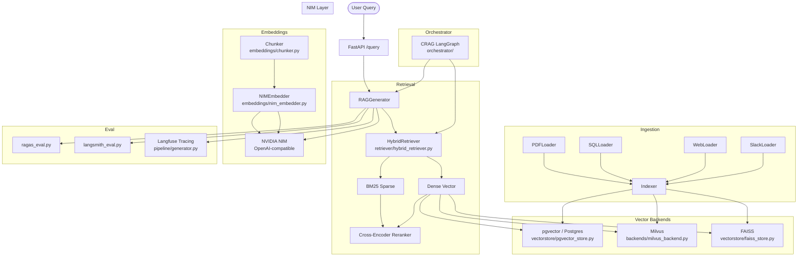

# Enterprise RAG Pipeline — Architecture

## System Overview

Production-grade multi-source RAG pipeline with pluggable vector backends, hybrid retrieval, and RAGAS-driven evaluation.

## Component Diagram



## Directory Structure

```
enterprise-rag-pipeline/
├── ingestion/              # PDF, SQL, Web, Slack loaders
├── pipeline/               # embedder, indexer, retriever, generator (Langfuse-traced)
├── backends/               # pgvector_backend.py, milvus_backend.py
├── embeddings/             # nim_embedder.py (NIM OpenAI-compat), chunker.py
├── vectorstore/            # faiss_store.py, pgvector_store.py (3rd backend)
├── retriever/              # hybrid_retriever.py (BM25 + dense + reranker)
├── orchestrator/           # CRAG LangGraph pattern — corrective RAG loop
├── evals/                  # ragas_eval.py, langsmith_eval.py, ragas_runner.py
├── configs/                # pipeline.yaml, backends.yaml
├── deploy/                 # docker-compose.yml, k8s/
├── docs/                   # architecture.md (this file)
└── README.md
```

## Key Design Decisions

- **Backend swappability:** `VECTOR_BACKEND=pgvector|milvus|faiss` env var controls which store is used — no code changes
- **Three vector backends:** pgvector (Postgres, production), Milvus (enterprise scale), FAISS (lightweight local)
- **Hybrid retrieval:** BM25 (40%) + dense (60%) ensemble via `retriever/hybrid_retriever.py`, reranked by a cross-encoder
- **NIM embeddings:** `nvidia/nv-embedqa-e5-v5` via `embeddings/nim_embedder.py` (OpenAI-compatible NIM API)
- **CRAG pattern:** `orchestrator/` implements Corrective RAG — LangGraph loop that reformulates queries when retrieval confidence is low
- **Langfuse tracing:** Optional, graceful — `pipeline/generator.py` injects `CallbackHandler` when `LANGFUSE_PUBLIC_KEY` is set
- **RAGAS metrics:** faithfulness, answer relevancy, context recall, context precision — tracked per pipeline config

## Integration with nvidia-nim-agent-toolkit

The DocAgent in `nvidia-nim-agent-toolkit` can delegate retrieval to this pipeline's `/query` endpoint, making this repo the RAG backend for the full agent system.
